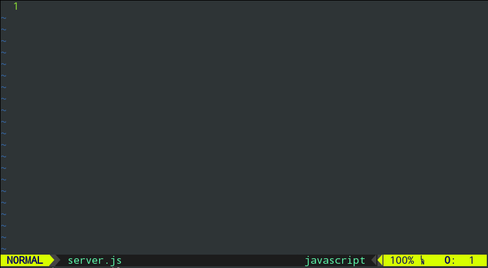

# Vim Snippets for Node.js

Snippets for node.js that conform to stanrad rules. The aim is to provide an extensive
set of snippets for Node core that conform to the [StandardJs](http://standardjs.com/) 
rules.

[](https://github.com/feross/standard)

## Installation
This requires [vim-snipmate](https://github.com/garbas/vim-snipmate) be installed first.

### Vundle
```
Plugin 'gangleri/snipmate-nodejs'
```

## Usage


